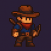
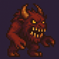
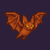
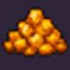

# HuntTheWumpus


You can see it live here: [https://agreeable-river-04a1e2f1e.1.azurestaticapps.net/](https://agreeable-river-04a1e2f1e.1.azurestaticapps.net/)


## Project Description


Embark on a perilous journey into the legendary Wumpus Caverns—a sprawling 20x20 labyrinth teeming with hidden dangers and ancient treasure. In this web-based adventure, you guide a daring explorer through twisting tunnels, evading bottomless pits, mischievous bats, and the dreaded Wumpus itself. Your quest: outwit the hazards, claim the fabled gold, or defeat the monster that lurks in the shadows. Built with React and TypeScript, and inspired by classic logic games, Hunt the Wumpus blends strategy, suspense, and a touch of luck in every playthrough.


Based on [This Repo](https://github.com/Epivaral/Projects/tree/main/Hunt_the_Wumpus), I made this project long time ago for an University Project, but it was text only.
with the help of Github Copilot, I was able to give this game a proper frontend using React and Typescript.


## Inhabitants and Mysteries of the Cavern

| Image | Description |
|-------|-------------|
|  | **Agent:** The brave explorer—a cunning adventurer who dares to enter the perilous Wumpus Caverns. Driven by legends of lost treasure, the agent must rely on wits and courage to survive lurking dangers and claim the legendary gold. |
|  | **Wumpus:** The fearsome Wumpus—a monstrous beast that haunts the deepest shadows of the cave. Its foul stench warns of its presence, and a single misstep means certain doom—unless the agent is bold enough to face it with bow and arrow. |
|  | **Bat:** Mischievous cave bats—ancient guardians of the labyrinth. If disturbed, they snatch the explorer and whisk them away to a random, unknown chamber, scattering all sense of direction and forcing a new path through the darkness. |
|  | **Pit:** Bottomless pits—remnants of ancient collapses and forgotten traps. One wrong move, and the explorer will plummet into the abyss, never to be seen again. A chilling breeze is the only warning of their presence. |
|  | **Gold:** The fabled treasure—hidden for centuries in the heart of the cave. Many have sought it, but only the clever and the lucky will find it and escape with their fortune. |


## Game Rules

- **Gold (x1):** If the agent enters the gold cell, it immediately wins the game.

  There is no notification in adjacent rooms.
  
- **Wumpus (x1):** If the agent enters the Wumpus cell, it immediately loses.

  If adjacent, the agent receives the message "You smell something terrible" and can shoot an arrow (if available).

  If the shot hits (1/8 chance), the agent wins. If it misses or has no arrows left, the agent must continue exploring. The agent starts with 3 arrows and can only shoot once per move.

- **Pit (x4):** If the agent enters a pit cell, it immediately loses.

  If adjacent, the agent receives the message "You feel a breeze" and will backtrack to avoid the pit.

- **Bat (x8):** If the agent enters a bat cell, it is teleported to a random empty cell, and its exploration stack is reset (visited cells are kept, so the agent does not revisit them).

  If adjacent, the agent receives the message "You hear flapping" and may risk entering the cell once.
  
- **Exploration:** The agent explores the cave using DFS, marking explored cells and backtracking when necessary.

  If there are no more cells to explore, the agent loses.


## How It Was Made

- **Frontend:** Built with React and TypeScript, providing a modern, interactive UI for visualizing the cave, agent, and hazards. The game logic, agent movement, and auto-play are implemented in TypeScript.
- **Assets:** Custom icons for the agent, Wumpus, bats, pits, and gold are used for clear visualization.
- **Agent Logic:** The agent uses a depth-first search (DFS) algorithm to explore the cave, avoid dangers, and attempt to win by either finding the gold or killing the Wumpus. The agent's logic is inspired by the classic rules and a Python reference implementation.
- **Auto Play:** The game runs in automatic mode, with the agent making decisions and moving step by step. Manual mode has been removed for simplicity.

---

## Project Structure Overview

- `hunt-the-wumpus-react/` — Main React app (TypeScript)
  - `src/`
    - `App.tsx` — Main app component, manages game state and UI
    - `components/` — UI components (Board, Controls, Stats, etc.)
    - `utils/`
      - `gameLogic.ts` — Core game and agent logic
      - `gameTypes.ts` — TypeScript types for game entities
    - `assets/` — Game icons
      - `agent.png` — The agent/player
      - `wumpus.png` — The Wumpus (monster)
      - `bat.png` — Bat hazard
      - `pit.png` — Pit hazard
      - `gold.png` — Gold (treasure)
  - `public/` — Static files (e.g., `index.html`)


## How the App Works (Step by Step)

1. **Game Initialization**
   - When the app loads or the user clicks **New Game**, a new board is generated in `gameLogic.ts`.
   - Hazards (Wumpus, pits, bats, gold) are randomly placed on the board.
   - The agent is placed in a random empty cell.

2. **Rendering the Board**
   - The `Board` component (`Board.tsx`) displays the grid, agent, and hazards (with icons from `assets/`).
   - The `Stats` and `Controls` components show the agent's status and allow the user to start/step the game.

3. **Agent Turn (Auto Play)**
   - On each step, the agent's next move is determined by the DFS-based algorithm in `gameLogic.ts`.
   - The agent checks its current cell for hazards (gold, pit, Wumpus, bat) and logs the outcome.
   - If alive, the agent explores adjacent cells, marks visited cells, and backtracks if needed.
   - If adjacent to a Wumpus, the agent may shoot an arrow (one per move, 1/8 chance to hit).
   - If the agent enters a bat cell, it is teleported and its exploration stack resets (visited cells are kept).
   - The action log records each decision and outcome.

4. **Game End**
   - The game ends if the agent finds gold (win), falls into a pit, is eaten by the Wumpus, or runs out of moves.
   - The UI updates to reflect the outcome and disables further moves.

---

## Depth-First Search (DFS) Algorithm Explained

The agent uses a DFS strategy to explore the cave. DFS is a graph traversal algorithm that explores as far as possible along each branch before backtracking. In this game:

- The agent maintains a **stack** of cells to visit (the DFS path).
- On each turn, the agent:
  1. Checks the current cell for hazards (gold, pit, Wumpus, bat).
  2. If alive, looks for unvisited, safe-looking adjacent cells and pushes one onto the stack.
  3. If no unvisited neighbors are available, the agent pops the stack to backtrack.
  4. If the stack is empty, the agent loses (no moves left).
- If the agent enters a bat cell, the stack is reset to only the new teleport cell, but the visited cells are kept, so the agent does not revisit old cells.
- DFS ensures the agent explores every reachable cell, backtracking when it hits dead ends or hazards.

**DFS Example:**
- Start at cell A. Mark as visited.
- For each neighbor of A, if unvisited, move to neighbor and repeat.
- If all neighbors are visited or unsafe, backtrack to previous cell.
- Continue until gold is found, a hazard is encountered, or no moves remain.

---

## Developer Tutorial: How to Build and Extend the App

1. **Clone the Repository**
   ```bash
   git clone <repo-url>
   cd HuntTheWumpus/hunt-the-wumpus-react
   ```

2. **Install Dependencies**
   ```bash
   npm install
   ```

3. **Run the App**
   ```bash
   npm start
   ```
   The app will be available at `http://localhost:3000`.

4. **Project Structure**
   - `src/utils/gameLogic.ts`: Core game and agent logic. Modify here to change rules, agent behavior, or hazards.
   - `src/components/`: UI components. Update or add components for new features or UI changes.
   - `src/assets/`: Game icons. Replace or add PNGs for new entities.
   - `src/App.tsx`: Main app logic and state management.

5. **Modifying Game Logic**
   - To change how the agent explores, edits go in `gameLogic.ts` (e.g., DFS, hazard handling, win/loss conditions).
   - To add new hazards or features, define new types in `gameTypes.ts` and update the board setup in `gameLogic.ts`.

6. **Customizing the UI**
   - Update components in `src/components/` for new controls, stats, or board features.
   - Edit CSS in `App.css`, `Board.css`, etc., for styling.

7. **Adding/Editing Assets**
   - Place new PNGs in `src/assets/` and reference them in the board rendering logic.

8. **Testing**
   - Use the action log and UI to verify agent behavior and game outcomes.
   - Add unit tests for logic in `gameLogic.ts` as needed.

---

## Technologies Used

- React
- TypeScript
- Custom CSS

---
Enjoy playing Hunt the Wumpus!
