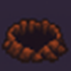

# Hunt The Wumpus

My personal view on the [classic game](https://en.m.wikipedia.org/wiki/Hunt_the_Wumpus), played by an agent that uses a depth-first search (DFS) or A* algorithm to explore the cave, avoid dangers, and attempt to win by either finding the gold or killing the Wumpus. 

You can see it live here: [https://agreeable-river-04a1e2f1e.1.azurestaticapps.net/](https://agreeable-river-04a1e2f1e.1.azurestaticapps.net/)


## Project Description


Embark on a perilous journey into the legendary Wumpus Caverns—a sprawling 20x20 labyrinth teeming with hidden dangers and ancient treasure. In this web-based adventure, you guide a daring explorer through twisting tunnels, evading bottomless pits, mischievous bats, and the dreaded Wumpus itself. 

Agent's quest: outwit the hazards, claim the fabled gold, or defeat the monster that lurks in the shadows. Built with React and TypeScript, and inspired by classic logic games, Hunt the Wumpus blends strategy, suspense, and a touch of luck in every playthrough.

Based on [This Repo](https://github.com/Epivaral/Projects/tree/main/Hunt_the_Wumpus), I made this project long time ago for an University Project, but it was text only.
With the help of Github Copilot, I was able to give this game a proper frontend using React and Typescript.


## Inhabitants and Mysteries of the Cavern

| Image | Description |
|-------|-------------|
|  | **Agent:** The brave explorer—a cunning adventurer who dares to enter the perilous Wumpus Caverns. Driven by legends of lost treasure, the agent must rely on wits and courage to survive lurking dangers and claim the legendary gold. |
|  | **Wumpus:** The fearsome Wumpus—a monstrous beast that haunts the deepest shadows of the cave. Its foul stench warns of its presence, and a single misstep means certain doom—unless the agent is bold enough to face it with bow and arrow. |
|  | **Bat:** Mischievous cave bats—ancient guardians of the labyrinth. If disturbed, they snatch the explorer and whisk them away to a random, unknown chamber, scattering all sense of direction and forcing a new path through the darkness. |
|  | **Pit:** Bottomless pits—remnants of ancient collapses and forgotten traps. One wrong move, and the explorer will plummet into the abyss, never to be seen again. A chilling breeze is the only warning of their presence. |
|  | **Gold:** The fabled treasure—hidden for centuries in the heart of the cave. Many have sought it, but only the clever and the lucky will find it and escape with their fortune. |


## Game Rules & Features (2025 Update)

- **Gold (x1):** If the agent enters the gold cell, it immediately wins the game. There is no notification in adjacent rooms.
- **Wumpus (x1):** If the agent enters the Wumpus cell, it immediately loses. If adjacent, the agent receives the message "You smell something terrible" and can shoot an arrow (if available). If the shot hits (1/8 chance), the agent wins. The agent starts with 3 arrows and can only shoot once per move.
- **Pit (x3):** If the agent enters a pit cell, it immediately loses. If adjacent, the agent receives the message "You feel a breeze" and will backtrack to avoid the pit.
- **Bat (x6):** If the agent enters a bat cell, it is teleported to a random empty cell, and its exploration stack is reset (visited cells are kept, so the agent does not revisit them). If adjacent, the agent receives the message "You hear flapping" and may risk entering the cell once.
- **Walls:** Random wall clusters are generated, blocking movement and exploration.
- **Exploration:** The agent explores the cave using DFS or A* (selectable), marking explored cells and backtracking when necessary. If there are no more cells to explore, the agent loses.
- **Fog of War:** The board is covered by a persistent fog. Only the agent's current cell and a special "squircle/octagon" area (7x7 square with 2x2 corners cut off) around it are visible. As the agent moves, newly visible cells are permanently revealed. Fog is purely cosmetic and does not affect gameplay logic.


## How It Was Made

- **Frontend:** Built with React and TypeScript, providing a modern, interactive UI for visualizing the cave, agent, and hazards. The game logic, agent movement, and auto-play are implemented in TypeScript.
- **Assets:** Custom icons for the agent, Wumpus, bats, pits, and gold are used for clear visualization.
- **Agent Logic:** The agent uses a depth-first search (DFS) or A* algorithm to explore the cave, avoid dangers, and attempt to win by either finding the gold or killing the Wumpus. The agent's logic is inspired by the classic rules and a Python reference implementation. DFS and A* are both available and selectable in the UI.
- **Auto Play:** The game runs in automatic mode, with the agent making decisions and moving step by step. Manual mode has been removed for simplicity.
- **Fog of War:** Implemented as a persistent, cosmetic overlay. The visible area is a squircle/octagon shape, matching the reference grid provided by the user.
- **Codebase Cleanup:** All code has been reviewed and refactored for clarity, maintainability, and minimalism. Unused code and redundant logic have been removed.

---

## Project Structure Overview

- `hunt-the-wumpus-react/` — Main React app (TypeScript)
  - `src/`
    - `App.tsx` — Main app component, manages game state and UI
    - `components/` — UI components (Board, Controls, Stats, etc.)
    - `utils/`
      - `gameLogic.ts` — Core game and agent logic (DFS, A*, fog, hazards)
      - `gameTypes.ts` — TypeScript types for game entities
    - `assets/` — Game icons
      - `agent.png` — The agent/player
      - `wumpus.png` — The Wumpus (monster)
      - `bat.png` — Bat hazard
      - `pit.png` — Pit hazard
      - `gold.png` — Gold (treasure)
  - `public/` — Static files (e.g., `index.html`)


## How the App Works (Step by Step)

1. **Game Initialization**
   - When the app loads or the user clicks **New Game**, a new board is generated in `gameLogic.ts`.
   - Hazards (Wumpus, pits, bats, gold, walls) are randomly placed on the board.
   - The agent is placed in a random empty cell.
   - The fog grid is initialized, and the agent's visible area is revealed using the squircle/octagon shape.

2. **Rendering the Board**
   - The `Board` component (`Board.tsx`) displays the grid, agent, and hazards (with icons from `assets/`).
   - The `Cell` component overlays fog on cells that are still hidden.
   - The `Stats` and `Controls` components show the agent's status and allow the user to start/step the game and select the algorithm (DFS or A*).

3. **Agent Turn (Auto Play, DFS or A*)**
   - On each step, the agent's next move is determined by the selected algorithm (DFS or A*) in `gameLogic.ts`.
   - The agent checks its current cell for hazards (gold, pit, Wumpus, bat) and logs the outcome.
   - If alive, the agent explores adjacent cells, marks visited cells, and backtracks if needed.
   - If adjacent to a Wumpus, the agent may shoot an arrow (one per move, 1/4 chance to hit).
   - If the agent enters a bat cell, it is teleported and its exploration stack resets (visited cells are kept).
   - The action log records each decision and outcome.
   - The fog is updated to reveal the new visible area after each move.

4. **Game End**
   - The game ends if the agent finds gold (win), falls into a pit, is eaten by the Wumpus, or runs out of moves.
   - The UI updates to reflect the outcome and disables further moves.

---

## Depth-First Search (DFS) & A* Algorithm Explained

- **DFS:** The agent maintains a stack of cells to visit. On each turn, it checks the current cell for hazards, explores unvisited, safe-looking adjacent cells, and backtracks if needed. If the stack is empty, the agent loses.
- **A\*:** The agent uses the A* pathfinding algorithm to find the shortest path to the gold, considering only passable cells. If a path exists, the agent follows it step by step. If not, it continues exploring with DFS logic.


**DFS Example:**
- Start at cell A. Mark as visited.
- For each neighbor of A, if unvisited, move to neighbor and repeat.
- If all neighbors are visited or unsafe, backtrack to previous cell.
- Continue until gold is found, a hazard is encountered, or no moves remain.

**A\* Example:**
- Compute the shortest path from the agent to the gold, avoiding walls, pits, and the Wumpus.
- Move along the path, updating the fog and explored cells.
- If the path is blocked or no path exists, revert to DFS exploration.

---

## Guide for Noobs: How to Build and Extend the App (2025)

### 1. **Clone the Repository**
If you haven't already, download the project code to your computer:
```bash
git clone <repo-url>
cd HuntTheWumpus/hunt-the-wumpus-react
```

### 2. **Install Dependencies**
This project uses Node.js and npm (Node Package Manager). If you don't have them, install from [nodejs.org](https://nodejs.org/).

Then, in your project folder, run:
```bash
npm install
```
This will download all the libraries the app needs.

### 3. **Run the App Locally**
Start the development server with:
```bash
npm start
```
After a few seconds, your browser should open to `http://localhost:3000` and show the game. If not, open that address manually.

### 4. **Project Structure Overview**
- `src/` — All the code for the game lives here.
  - `App.tsx` — Main app component, manages game state and UI.
  - `components/` — UI pieces like the board, stats, and controls.
  - `utils/`
    - `gameLogic.ts` — The brain: all game rules, agent logic, fog, and hazards.
    - `gameTypes.ts` — TypeScript types for game entities.
  - `assets/` — Game icons (PNG images for agent, Wumpus, etc).
- `public/` — Static files (like `index.html`).

### 5. **How to Change Game Logic**
- Open `src/utils/gameLogic.ts` in your code editor.
- Here you can:
  - Change how the agent explores (DFS or A* logic).
  - Add or remove hazards (bats, pits, etc).
  - Adjust fog-of-war shape (look for the squircle/octagon code).
  - Change win/loss rules.
- If you want to add new hazards, also update `gameTypes.ts`.

### 6. **How to Change the UI**
- UI components are in `src/components/`.
- For example, to change how the board looks, edit `Board.tsx` and `Cell.tsx`.
- To change stats or controls, edit `Stats.tsx` or `Controls.tsx`.
- For colors and layout, edit the CSS files: `App.css`, `Board.css`, etc.

### 7. **How to Add or Change Images**
- Put new PNG images in `src/assets/`.
- Reference them in the code (for example, in `Cell.tsx` or `Board.tsx`).

### 8. **How to Test Your Changes**
- Every time you save a file, the app reloads automatically in your browser.
- Use the action log and the UI to check if the agent behaves as expected.
- For deeper testing, you can add unit tests for logic in `gameLogic.ts` (advanced).

### 9. **Common Problems & Tips**
- If you see errors in the terminal, read the message carefully. Most are missing files or typos.
- If the app doesn't load, make sure you ran `npm install` and are in the right folder.
- If you want to reset the game, just click **New Game** in the UI.
- You can always undo changes by using version control (git) or re-downloading the repo.

---

## Technologies Used

- React
- TypeScript
- Custom CSS

---

## Quest for the students: 

Implement the Human Player logic, where you can control the agent, instead the auto-explore.
